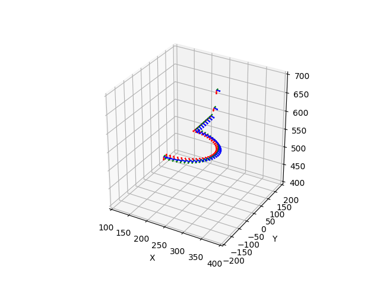

# trajectory-orientation-plotter
 - The parameters for plotting listed below can be modified in **/Data/Parameters.xml**
   - File path for pose data
   - The scale of the unit conversion
   - Sampling interval
   - Boundary of axis

- Gui specification
   - Main window

     
   - Click "Open File" button to load file for pose data
   - Click "Load Param" button to load parameters for plotting
   - Click "Plot" to plot the trajectory and the orientation
   - Click "Close All Figs" to close all figures
   - The file path and the parameters for plotting can be modified in the entry

## Usage
- Plot with python
  ```
  python PlotterGuiMain.py
  ```
- Demo
  <div align=center></div>
  <div align=center></div>
  <div align=center></div>
